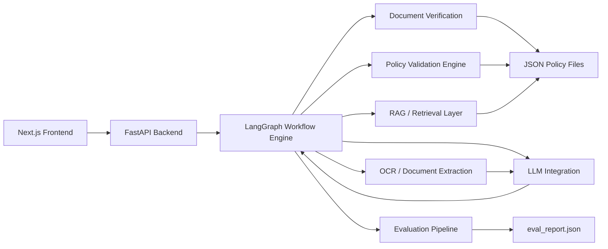

# Plum

[](https://www.python.org/)
[](https://fastapi.tiangolo.com/)
[](https://nextjs.org/)
[](LICENSE)

Plum is an AI-powered health insurance claims processing platform designed for explainable, policy-driven decisioning. The system supports claim intake, early document validation, OCR-based extraction, policy evaluation, decision tracing, and evaluation-driven testing for medical claims workflows.

This repository demonstrates a production-oriented architecture for automating claims adjudication while preserving transparency, auditability, and graceful degradation under component failures.

## Overview

Plum combines:
- a Next.js frontend for claim submission and review
- a FastAPI backend for APIs and orchestration
- LangGraph workflows for multi-stage processing
- deterministic policy validation for financial and policy decisions
- LLM-assisted extraction and reasoning with structured fallbacks
- an evaluation pipeline for reproducible validation of edge cases

## Key Features

- Explainable AI claim evaluation with human-readable audit trails
- OCR and document extraction for bills, prescriptions, and lab reports
- RAG-inspired policy retrieval using structured policy resources and JSON policy files
- LangGraph orchestration for staged claim processing
- Hybrid rule-based + LLM validation for robust decisioning
- Early document verification to stop incomplete claims before downstream processing
- Evaluation harness for 12 assignment-style scenarios and report generation

## Architecture Diagram



## UI Screenshots and Demo

The following screenshots capture the current interface and workflow experience from the repository.

### Dashboard


### Claim submission page


### Claim evaluation workflow


### AI assistant interaction


### Additional workflow view


### Additional review view


## API Documentation

### Base URL
- Local development: http://localhost:8000

### Endpoints

| Endpoint | Method | Purpose |
| --- | --- | --- |
| /claims/submit | POST | Submit a claim for processing |
| /claims/evaluate | POST | Run evaluation against the configured test suite |
| /claims/status/{id} | GET | Retrieve the status and decision trace for a claim |
| /chat | POST | Send a conversational prompt for policy or workflow assistance |
| /health | GET | Basic service health check |

### Example request: submit a claim

```bash
curl -X POST http://localhost:8000/claims/submit \
  -H "Content-Type: application/json" \
  -d '{
    "member_id": "EMP001",
    "policy_id": "PLUM_GHI_2024",
    "claim_category": "CONSULTATION",
    "treatment_date": "2024-11-01",
    "claimed_amount": 1500,
    "documents": [
      {
        "file_id": "doc-1",
        "file_name": "prescription.jpg",
        "actual_type": "PRESCRIPTION",
        "quality": "GOOD"
      },
      {
        "file_id": "doc-2",
        "file_name": "bill.jpg",
        "actual_type": "HOSPITAL_BILL",
        "quality": "GOOD"
      }
    ]
  }'
```

### Example response

```json
{
  "claim_id": "CLM_12345",
  "decision": "APPROVED",
  "approved_amount": 1350,
  "confidence_score": 0.98,
  "reasons": [],
  "trace": [
    {"step": "claim_intake", "status": "PASSED"},
    {"step": "document_verification", "status": "PASSED"}
  ]
}
```

### Example request: health check

```bash
curl http://localhost:8000/health
```

## Evaluation Metrics

The repository includes an evaluation runner that exercises a defined set of claims scenarios and stores results in [backend/app/evaluators/eval_report.json](backend/app/evaluators/eval_report.json).

### Test execution flow
1. Load policy files and test cases.
2. Construct claim requests from the JSON test fixtures.
3. Invoke the full workflow engine.
4. Compare expected vs. actual decisions and trace outputs.
5. Persist the results in the eval report.

### Metrics tracked

| Metric | Description |
| --- | --- |
| Accuracy | Percentage of expected decisions that match output decisions |
| Validation Precision | Correctness of early document verification and entity checks |
| Workflow Completion Rate | Percentage of claims that reach a complete decision path |
| Response Latency | Time required to process a claim end to end |
| Hallucination Reduction | Confidence degradation and traceability when extraction fails |

## Project Structure

```text
backend/                # FastAPI backend, routes, workflows, and evaluation logic
frontend/               # Next.js app for claim intake and review
Docs/                   # System architecture and component contract documents
docs/images/            # Placeholder screenshots and demo assets
policy_terms.json       # Policy configuration used by the engine
test_cases.json         # Assignment and evaluation test cases
DEPLOYMENT.md           # Local and hosted deployment guidance
```

## Local Development

### Backend setup

```bash
python -m pip install -r backend/requirements.txt
python backend/app/main.py
```

### Frontend setup

```bash
cd frontend
npm install
npm run dev
```

### Environment variables

Copy the example file and adjust values as required:

```bash
copy .env.example .env
```

Suggested variables:
- `GROQ_API_KEY` for LLM-backed workflows
- `GROQ_MODEL` for model selection
- `APP_ENV` for environment mode
- `LOG_LEVEL` for logging verbosity
- `CORS_ORIGINS` for frontend/backend connectivity

## Deployment Notes

- Backend can be deployed on Render, Railway, Fly.io, or Azure App Service.
- Frontend can be deployed on Vercel or Netlify.
- Set `NEXT_PUBLIC_API_URL` in the frontend environment to the deployed backend URL.
- Ensure the backend CORS configuration includes your frontend origin.

## Verification

The project has been verified locally with:
- `pytest backend/app/tests -q`
- `npm run build`
- `python backend/app/evaluators/eval_runner.py`

Current evaluation status: 12/12 test cases passed (100%).

## Future Improvements

Planned enhancements include:
- multi-policy support for different insurance products
- stronger fraud detection and anomaly scoring
- vector database integration for policy retrieval
- multilingual support for claims intake and review
- human-in-the-loop approvals for sensitive cases
- cloud-native deployment and observability improvements
- executive analytics dashboards for claims operations

## Documentation

- Architecture: [docs/architecture.md](docs/architecture.md)
- Component contracts: [docs/component_contracts.md](docs/component_contracts.md)
- Deployment guide: [DEPLOYMENT.md](DEPLOYMENT.md)
