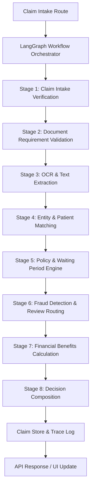

# System Architecture - Health Insurance Claims Processing System

This document outlines the architectural design and system considerations for the production-grade AI-powered Health Insurance Claims Processing System.

## System Overview

The system is designed to automate health insurance claims processing using a hybrid architecture:
- **LLM/Cognitive Layer**: Responsible for fuzzy text extraction (OCR), unstructured document interpretation, doctor registration validation, and patient name matching.
- **Deterministic Rules Engine**: Governs the final policy compliance validation, pre-authorization logic, benefit limits, network hospital discounts, and co-payment calculations.

By separating unstructured cognitive tasks from financial and policy logic, we ensure 100% auditability and predictability. LLMs are never allowed to make financial approval or rejection decisions directly.

---

## Agent Responsibilities

The system is orchestrated using a multi-agentic pipeline run via LangGraph:
1. **Intake Agent**: Resolves member details in the roster and checks date eligibility.
2. **Document Verification Agent**: Analyzes uploaded document files, validates types against the category requirements checklist, and flags unreadable documents early.
3. **OCR Agent**: Utilizes Vision LLMs to extract itemized medicine lists, billing totals, diagnoses, and medical practitioners.
4. **Validation Agent**: Compares extracted names against the member roster using fuzzy matching and validates doctor credentials against Indian state medical board registry formats.
5. **Policy Engine (Deterministic)**: Evaluates sub-limits, exclusions, pre-authorization, and waiting periods.
6. **Fraud Agent**: Monitors claim velocities (same-day and monthly frequencies) and high-value claim criteria.

---

## Design Decisions & Tradeoffs

### 1. Deterministic vs. LLM-Based Policy Evaluation
- **Decision**: Final decisions and financial deductions are executed via a deterministic rule engine (`policy_engine.py`) reading dynamically from `policy_terms.json`, rather than letting LLMs interpret policy.
- **Rationale**: Insurance claims require absolute correctness. If an LLM is asked to calculate a 10% copay on an Apollo Hospital consultation after a 20% network discount, it can easily hallucinate. A deterministic python module ensures the code behavior matches legal policy guidelines precisely.
- **Tradeoff**: Increases upfront development time to model policy categories, but eliminates LLM variance.

### 2. Early-Halt Document Verification
- **Decision**: Stop the workflow immediately if required document types are missing or if a document is unreadable.
- **Rationale**: Prevents waste of LLM API resources (OCR extraction) on claims that are legally incomplete. Provides rapid feedback loops for members.

---

## Scaling Considerations

To handle a 10x load increase (from 75,000 claims to 750,000+ claims annually):
1. **Queue-Based Extraction**: Decouple the REST API from the LangGraph pipeline using a task broker (e.g., Celery/Redis). Write the claim to a PostgreSQL database, return a receipt ID, and process the workflow asynchronously.
2. **Document Preprocessing**: Run local OpenCV filters on uploaded images (auto-contrast, deskewing) before passing them to Vision LLMs. This improves OCR accuracy and reduces token sizes.
3. **Caching & Embeddings**: Cache doctor registration validity lookups and hospital name matching results.

---

## Failure Handling Strategy

If a pipeline stage fails (e.g., an LLM timeout during OCR):
- The LangGraph node catches the exception.
- It records a failure status event in the trace timeline.
- It degrades the overall `confidence_score` (e.g. subtracting 0.3) and flags the claim for `MANUAL_REVIEW` while allowing subsequent nodes (such as the policy limits and calculations) to continue executing in a degraded state.
- The pipeline never throws a 500 server crash, preserving operational visibility.
